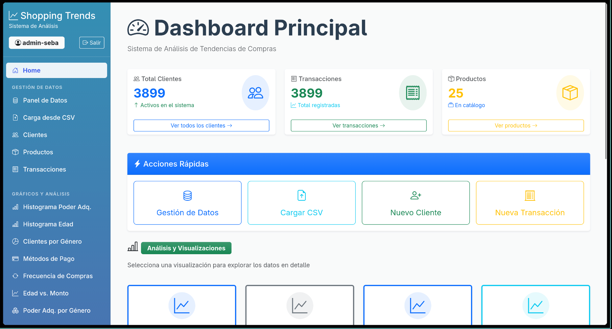

# Dashboard de Análisis de Compras

Este proyecto es una herramienta web pensada para visualizar y entender mejor los datos de compras de una tienda. Lo armé usando Django y el objetivo principal es transformar planillas de datos aburridas en gráficos interactivos y tableros de control que realmente te digan algo.

## ¿De qué se trata?

La aplicación toma datos de tendencias de compras (como clientes, qué compraron, cuánto gastaron, etc.) y los presenta de forma ordenada. No es solo para mirar gráficos; también funciona como un pequeño sistema de gestión donde puedes administrar la base de datos de clientes y transacciones.

## ¿Cómo funciona?

Es bastante directo:

1.  **El Dashboard**: Al entrar, te encuentras con un panel principal que te muestra los números grandes: cuántos clientes hay, cuántas ventas se han hecho, etc.
2.  **Los Gráficos**: Hay una sección dedicada a visualizar la data. Puedes ver cosas como:
    *   Qué métodos de pago prefiere la gente.
    *   La edad promedio de los compradores.
    *   Comparaciones entre género y poder adquisitivo.
3.  **Gestión de Datos**: Si necesitas meter mano en los datos, puedes hacerlo. Permite subir archivos CSV para cargar mucha información de golpe, o ir agregando clientes y ventas uno por uno.

## Tecnologías

Está construido principalmente con **Python** y **Django** en el backend. Para que se vea bien y los gráficos funcionen, usa **Bootstrap** y **Chart.js**.

---
*Proyecto realizado para el certamen de Visualización de Datos.*
